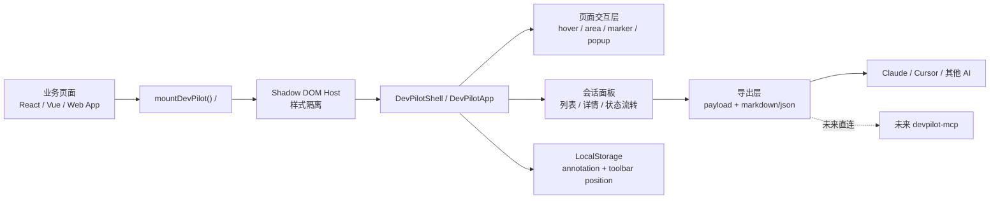
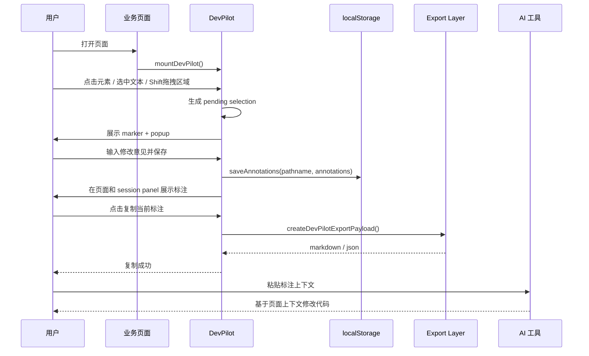
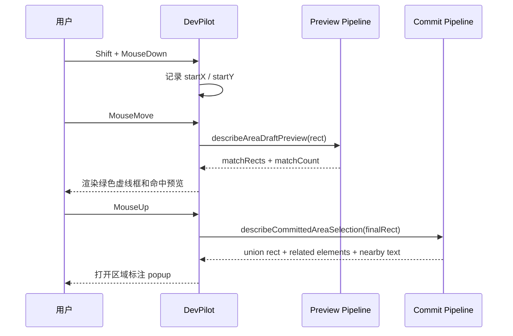
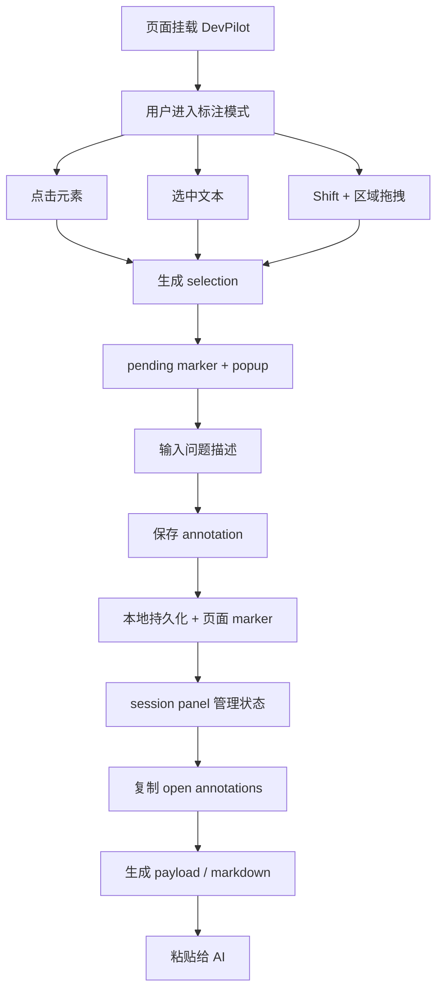

# DevPilot 中文技术方案

## 1. 文档目标

本文档用于系统说明 `DevPilot` 当前阶段的产品定位、技术方案、架构设计和实现细节。它重点回答以下问题：

- 研发在页面问题反馈和 AI 协作开发过程中，当前存在哪些痛点
- `DevPilot` 实际解决了哪些问题
- 当前前端包的总体架构、关键流程和时序关系是什么
- 各核心技术方案为什么这样设计
- 后续还需要补哪些能力

当前文档基于仓库里的实际实现来描述，核心实现集中在 [packages/devpilot/src/index.tsx](/Users/didi/project/stability-copilot-platform/packages/devpilot/src/index.tsx)、[packages/devpilot/src/view.tsx](/Users/didi/project/stability-copilot-platform/packages/devpilot/src/view.tsx)、[packages/devpilot/src/storage.ts](/Users/didi/project/stability-copilot-platform/packages/devpilot/src/storage.ts)、[packages/devpilot/src/output.ts](/Users/didi/project/stability-copilot-platform/packages/devpilot/src/output.ts)。

## 2. 背景与目标

`DevPilot` 是一个面向前端页面的原位标注工具。它不是传统的“大抽屉问题中心”，而是把页面本身当作工作区，让用户直接在真实页面上标出需要修改的元素、文本或区域，再把结构化结果提供给 AI，用于辅助修改代码。

当前阶段的核心目标不是一次性做完整的 MCP 平台，而是先跑通这条最小闭环：

1. 页面挂载 `DevPilot`
2. 用户在真实页面上做标注
3. 标注内容带着页面上下文被结构化保存
4. 用户一键复制给 AI
5. AI 根据这些上下文更准确地修改代码

## 3. 开发过程中存在的痛点

### 3.1 页面问题反馈依赖截图和口头描述

在传统前端协作里，一个问题通常要经过“截图、发消息、补路径、补上下文、开发猜位置”这条链路。问题在于：

- 截图只能展示结果，不能表达 DOM 结构和交互上下文
- 文案描述容易丢失目标元素的精确位置
- 同一个页面上多个相似元素会导致理解偏差

### 3.2 AI 修改代码时缺少页面上下文

即使已经有 Claude、Cursor 这样的编码助手，如果只给一句“把这个输入框改一下”，AI 仍然缺少足够的上下文：

- 页面路径是什么
- 具体是哪一个元素
- 这个元素附近的文本是什么
- 这是一个单元素问题还是一个多元素区域问题
- 用户希望修改的是视觉、交互还是信息结构

没有这些上下文，AI 很容易改错位置，或者只能给出泛泛建议。

### 3.3 页面原位工具容易和宿主页面互相干扰

一个真正挂载在业务页面上的工具，会天然面临这些工程问题：

- 样式冲突
- 宿主页面全局快捷键和输入框冲突
- 拖拽和滚动、副作用事件互相影响
- overlay / marker / popup 的 z-index 与定位问题

如果这些问题处理不好，工具本身反而会破坏业务页面的体验。

### 3.4 区域标注的命中和视觉最难稳定

相比单个元素点击，区域标注要同时解决：

- 拖拽过程的预览反馈
- 最终命中元素的筛选
- 多元素摘要信息生成
- 原生文本选择、拖拽、滚动副作用压制

这部分实现难度远高于普通页面浮层。

### 3.5 接入成本如果太高，很难推广

如果一个页面标注工具要求复杂 SDK、专门后端、额外 iframe 或特定框架约束，实际推广成本会很高。  
因此第一版必须做到：

- 零配置或近零配置接入
- React / Vue / 任意 Web 页面都能挂
- 没有后端也能本地跑起来

## 4. 项目解决了什么问题

`DevPilot` 当前阶段主要解决三类问题。

### 4.1 让页面问题变成“结构化反馈”

用户不再需要靠截图和口头描述，而是可以直接在页面上：

- 点击单个元素标注
- 选中文本标注
- 拖拽区域标注

这样问题会被记录成结构化对象，而不是一段模糊描述。

### 4.2 让 AI 获取足够的修改上下文

导出层会把当前页面的 open annotations 转成标准化 payload 和 Markdown。  
这些内容包含：

- 页面路径、URL、标题、viewport
- 标注类型和状态
- 元素名称和元素路径
- 选中文本
- 附近文本
- 区域命中元素数量与 related elements
- 用户的修改意见

这样 AI 收到的不是“帮我改一下这里”，而是“带页面定位和上下文的可执行需求”。

### 4.3 把接入成本压到最低

当前对外入口已经收口为零配置挂载形式：

```ts
import { mountDevPilot } from "@littleee/devpilot";

mountDevPilot();
```

这意味着它可以被直接接到 React、Vue 或任意 Web 工程中，而不要求先建设一套后端服务。

## 5. 当前版本边界

### 5.1 已实现

- `@littleee/devpilot` 浏览器端前端包
- Shadow DOM 挂载与样式隔离
- launcher、toolbar、overlay、marker、popup、session panel
- 元素标注、文本标注、区域标注
- 本地状态持久化
- annotation 状态流转
- Markdown / JSON 导出能力

### 5.2 尚未实现

- `devpilot-mcp`
- SQLite 本地 store
- workspace / source resolution
- session / thread / reply 后端模型
- Claude / Cursor 通过 MCP 直接读写 observations

## 6. 总体架构图



## 7. 核心时序图

### 7.1 页面标注到 AI 修改代码的时序图



### 7.2 区域标注时序图



## 8. 主流程图



## 9. 模块级技术方案

## 9.1 挂载与样式隔离方案

核心文件：[packages/devpilot/src/index.tsx](/Users/didi/project/stability-copilot-platform/packages/devpilot/src/index.tsx)

实现方式：

- 通过 `mountDevPilot(options)` 创建宿主节点
- 用 `data-devpilot-host` 标记实例宿主
- `attachShadow({ mode: "open" })` 创建 Shadow DOM
- 在 Shadow DOM 内部插入样式节点和 React root container
- 用 `createRoot()` 渲染 `DevPilotShell`

这样设计的原因：

- 减少与宿主页面 CSS 的互相污染
- 避免业务页面的全局 reset 样式破坏工具条
- 保证 marker、popup、panel 的视觉一致性

### 关键收益

- 可嵌入任意前端页面
- 不强依赖宿主项目的样式体系
- 可作为单独 npm 包发布

## 9.2 标注数据模型方案

核心文件：[packages/devpilot/src/types.ts](/Users/didi/project/stability-copilot-platform/packages/devpilot/src/types.ts)

核心模型分为两层。

### Selection

`Selection` 表示“尚未保存的页面交互结果”，用于 popup 编辑阶段。

字段包括：

- `kind`
- `elementName`
- `elementPath`
- `rect`
- `pageX / pageY`
- `selectedText`
- `nearbyText`
- `relatedElements`
- `matchCount`

### Annotation

`Annotation` 表示“已经保存的标注记录”，会进入列表、持久化和导出。

当前状态机：

- `pending`
- `acknowledged`
- `resolved`
- `dismissed`

这样设计的原因是把“临时交互态”和“持久化实体”分开，避免 UI 编辑过程直接污染最终数据。

## 9.3 本地持久化方案

核心文件：[packages/devpilot/src/storage.ts](/Users/didi/project/stability-copilot-platform/packages/devpilot/src/storage.ts)

实现方式：

- annotation 按 `pathname` 存在 `localStorage`
- key 格式为 `devpilot.annotations:${pathname}`
- 工具条位置单独存在 `devpilot.position`
- 读取时会对状态字段进行归一化，兼容旧数据

当前选择本地存储的原因：

- 第一版要优先保证“零后端可用”
- 用户可以马上体验 annotation -> copy -> AI 的闭环
- 先压低系统复杂度，为后续 `devpilot-mcp` 留扩展空间

局限：

- 当前没有 session id / thread id / workspace id
- 只能覆盖本地单用户单页面场景

## 9.4 页面交互采集方案

核心文件：[packages/devpilot/src/view.tsx](/Users/didi/project/stability-copilot-platform/packages/devpilot/src/view.tsx)

页面交互层承担了最多的行为编排，主要包括：

- hover 高亮
- 元素点击标注
- 文本选中标注
- 区域拖拽标注
- popup 编辑
- marker 展示
- session panel 列表与详情

### 元素标注

在 capture 阶段监听 click：

- 先过滤 DevPilot 自身 DOM
- 再读取目标元素 rect、路径、附近文本
- 生成 `selection`
- 打开 popup

### 文本标注

通过 `window.getSelection()` 获取：

- 选中文本
- range rect
- anchor 对应元素

然后保留文本内容与元素上下文，一并进入标注编辑阶段。

### 区域标注

当前区域标注采用“双 pipeline”方案：

- 预览 pipeline：负责拖拽中的绿色虚线范围和命中预览
- 提交 pipeline：负责最终 annotation 的稳定数据

这样设计是因为：

- 拖拽过程更强调视觉反馈
- 最终提交更强调命中稳定性和可复现性
- 如果一套逻辑同时处理两者，容易产生体验抖动

## 9.5 区域命中与交互副作用控制方案

区域标注是当前实现里最复杂的部分。

### 当前实现重点

- `describeAreaDraftPreview(rect)` 负责预览态
- `describeCommittedAreaSelection(rect)` 负责提交态
- 拖拽过程中禁用原生文本选择
- 拖拽期间拦截 `dragstart` / `selectstart`
- area draft 存在时阻止 `wheel` / `touchmove` 的默认行为

### 技术要点

1. 拖拽预览和最终提交分开  
这样能把“视觉层”与“数据层”解耦。

2. 区域结果不是简单矩形  
最终会生成：
- union rect
- related elements
- nearby text
- match count

3. 要显式压制宿主页面副作用  
否则会出现滚动、文本选择、宿主拖拽行为干扰标注体验。

### 当前仍然存在的难点

- 区域命中在复杂业务组件下仍可能漏选或层级不稳
- 预览命中和最终提交结果仍需要继续收口

## 9.6 Popup 输入与宿主页快捷键隔离方案

当前实现里，textarea 输入事件会显式停止冒泡。

处理的事件包括：

- `beforeinput`
- `compositionstart / update / end`
- `keydown`
- `keyup`
- `paste`

这样做的原因是：

- 宿主页面可能注册了全局快捷键
- 如果不隔离，用户在输入框里打字时，按键可能被业务页面劫持

这属于“页面原位工具”里非常关键但容易忽略的细节。

## 9.7 会话面板与状态流转方案

当前会话面板本质上还是 annotation panel，但它已经具备 session-like 的管理能力。

实现特点：

- `openAnnotations` 和 `closedAnnotations` 分区展示
- 详情面板支持状态流转：
  - 标记处理中
  - 标记已解决
  - 忽略此项
  - 重新打开
- 点击页面 marker 会直接重新打开编辑框，而不是跳到另一个异步流程

这样设计的目的，是先把“页面问题管理”这件事做完整，再引入真正的 session/thread 后端模型。

## 9.8 导出与 AI 上下文方案

核心文件：[packages/devpilot/src/output.ts](/Users/didi/project/stability-copilot-platform/packages/devpilot/src/output.ts)

这是当前 MVP 最关键的一层，因为它直接决定 AI 能否看懂页面问题。

### 双轨导出方案

系统同时维护两种导出格式：

1. 结构化 payload  
`schema: "devpilot.page-feedback/v1"`

2. 面向 AI 的 Markdown  
包含页面级信息和每条 annotation 的上下文

### 为什么不是只导出 Markdown

因为 Markdown 适合人工复制，但不适合未来 MCP 或程序直接消费。  
所以当前设计里：

- payload 是 source of truth
- markdown 是展示和复制视图

### 当前导出内容包括

- 页面路径
- 页面标题
- URL
- viewport
- annotation summary
- 每条 annotation 的类型、状态、元素、路径、选中文本、附近文本、区域信息、反馈内容

这样生成的内容更适合作为 AI 修改代码时的输入上下文。

## 9.9 零配置接入与 npm 包化方案

当前包已经收口为 `@littleee/devpilot`。

接入方式：

```ts
import { mountDevPilot } from "@littleee/devpilot";

mountDevPilot();
```

关键点：

- 对外暴露命令式挂载入口
- 同时支持 React 组件形式 `<DevPilot />`
- 包内有独立 `dist/`
- 已配置 `main`、`types`、`exports`、`peerDependencies`

这个方案的价值是把接入成本降到最低，方便在 Darwin 这类存量业务项目中快速联调。

## 10. 为什么这个方案有效

从工程视角看，`DevPilot` 做对了三件最关键的事：

### 10.1 把页面问题采集前移到了真实页面

用户是在真实页面上操作，而不是跳到另一个管理后台。  
这让反馈与上下文天然绑定。

### 10.2 把 AI 所需的上下文结构化了

项目不是只做一个“标记点工具”，而是把标记点背后的页面信息组织成 AI 可消费的数据。

### 10.3 把复杂系统拆成前端 MVP 和未来 MCP 两阶段

第一阶段只解决“能不能用”：

- 挂载
- 标注
- 保存
- 复制

第二阶段再解决“能不能工程化协作”：

- MCP
- workspace
- source resolution
- agent replies

这种分阶段设计可以显著降低一次性系统建设的风险。

## 11. 当前风险与限制

### 11.1 区域标注仍是当前最大风险点

这是最复杂、最容易产生体验波动的模块。

### 11.2 当前还不是真正的 session / thread 系统

目前前端面板已经有 session 的 UI 影子，但后端模型还没有真正落地。

### 11.3 还没有自动代码定位能力

当前 AI 仍然主要依赖复制出的页面上下文，而不是直接定位本地仓库文件。

## 12. 后续演进方向

结合 [DEVPILOT_ROADMAP.md](/Users/didi/project/stability-copilot-platform/DEVPILOT_ROADMAP.md)，下一阶段主要是：

### v0.2 收口

- 继续打磨区域框选
- 做真实页面问题的端到端验证
- 优化导出内容的 AI 命中率

### v0.3 DevPilot-MCP

- 建立 HTTP bridge
- 建立 MCP stdio server
- 建立 SQLite store
- 支持 session / observation / reply / resolve

### v0.4+

- 稳定性模式
- workspace/source resolution
- Claude / Cursor 直接通过 MCP 读取观察结果

## 13. 一句话总结

`DevPilot` 当前的技术方案，本质上是在浏览器页面里构建一个轻量但结构化的“前端问题采集层”，把原本靠截图和口头描述传递的问题，转成 AI 能理解、后续 MCP 也能复用的标准化上下文。
